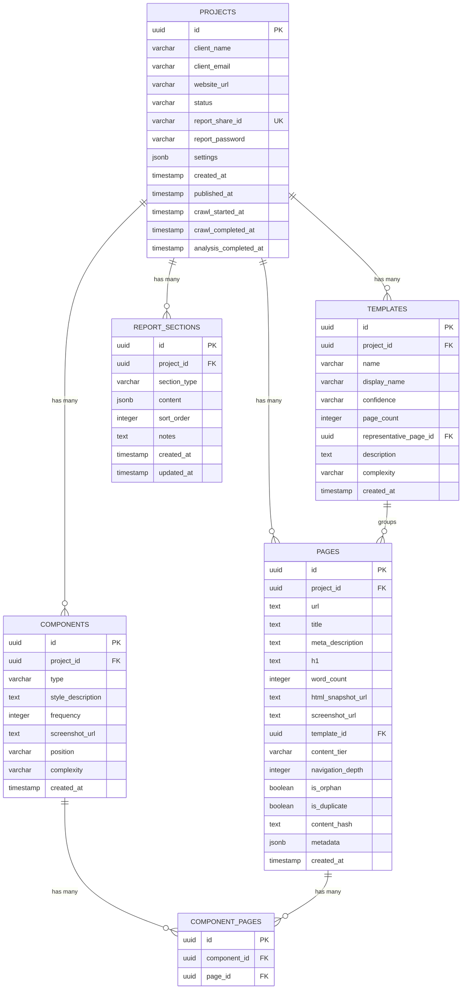
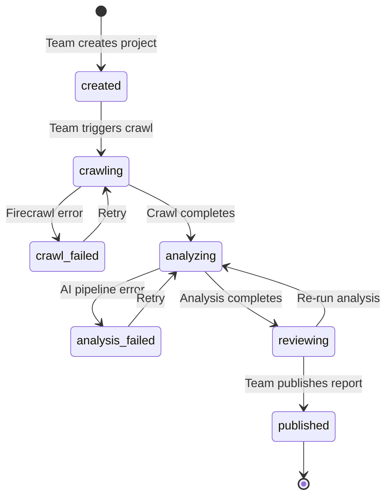

# Replatform Discovery Engine - Build Plan v2

## Overview

Build an AI-powered website analysis tool (internal to Pagepro) that crawls websites, runs multi-step AI analysis (template detection, component inventory, content scoring, complexity estimation), and generates professional migration audit reports. The tool serves Pagepro's sales process for Next.js + Sanity replatforming projects.

**Scope:** Internal tool only. No payment collection, no public landing page, no self-service. Pagepro team creates projects and triggers audits from the dashboard. Payment collection and public-facing features will be added after proving the tool works.

**Target test site:** https://pagepro.co
**Tech stack:** Next.js 16 (App Router), TypeScript, Tailwind v4, Shadcn/ui, PostgreSQL (Supabase), Firecrawl API, Inngest (durable functions), Claude API (Haiku + Sonnet), Vercel

## AI Workflow & Agent-Browser Verification

Every milestone includes agent-browser verification steps. The development workflow is:

1. **Implement** features for the milestone
2. **Verify with agent-browser** - use browser automation to visually confirm UI renders correctly, forms submit, data flows through the pipeline
3. **Test with pagepro.co** as the target site where applicable
4. **Review & feedback** - user reviews results, provides feedback
5. **Update plan** - adjust next milestones based on feedback

### Claude Code AI Workflow

When working on each milestone:
- Use `/compound-engineering:workflows:work` to implement each phase
- After implementation, use `agent-browser` to verify effects visually
- If issues found, fix and re-verify before moving to next milestone
- Keep the plan updated with actual findings and adjustments

---

## Architecture Decisions

| Decision | Choice | Rationale |
|----------|--------|-----------|
| Crawler | Firecrawl API | API-first, handles JS rendering, anti-bot, screenshots. No infra to manage. |
| Frontend | Next.js 16 App Router | Server Components for dashboard + public reports. |
| Database | Supabase (PostgreSQL) | Managed Postgres with storage and auth. No pgvector needed. |
| Background Jobs | Inngest | Serverless durable functions. Deploys with Vercel. No Redis, no separate worker. Handles retries, timeouts, step functions. |
| Auth | Supabase Auth | Already using Supabase. No need for a second auth system (Auth.js). |
| LLM - Classification | Claude Haiku 4.5 | Fast, cheap, sufficient for page-type classification. |
| LLM - Analysis/Vision | Claude Sonnet 4.6 | Best quality for component detection (vision) and report generation. |
| Embeddings | None (cut) | Duplicate detection via text hashing. No OpenAI dependency, no pgvector. |
| PDF Generation | Deferred | Web report is the primary deliverable. Cmd+P for PDF if needed. Add proper PDF generation later. |
| Sitemap Viz | Simple tree view | Collapsible tree with Tailwind + recursive components. No React Flow dependency. |
| ORM | Drizzle ORM | Type-safe, lightweight, excellent PostgreSQL support. |
| Testing | Vitest | Unit + integration tests from Phase 1. |
| Payments | None (deferred) | Internal tool for now. Add Stripe when business model is validated. |
| Email | None (deferred) | Manual communication for now. Add Resend when needed. |

---

## Database Schema (ERD)



**Key simplifications vs original:**
- No `EMBEDDINGS` table (cut pgvector entirely)
- No `LINKS` table (link data stored as JSONB in `pages.metadata` if needed)
- No `REPORT_ANALYTICS` table (deferred)
- Proper `COMPONENT_PAGES` join table instead of `uuid[]` array
- Added `REPORT_SECTIONS` for editable report content
- Added `content_hash` on pages for simple duplicate detection

---

## Audit State Machine



**Simplified to 6 states** (removed payment states, archived state).

---

## Phase 1: Foundation & Project Scaffolding

**Duration:** 3-4 days
**Milestone:** Project boots locally, dashboard shell renders, database connected, first test passes

### Tasks

#### 1.1 Repository Setup
- [x] Initialize git repository
- [x] Create `.gitignore` (node_modules, .env, .next, etc.)
- [x] Create `CLAUDE.md` with project conventions:
  - TypeScript strict mode
  - Server Components by default, Client Components only when needed
  - Drizzle ORM for all database queries
  - File naming: kebab-case for files, PascalCase for components
  - Use Server Actions for mutations, not API routes (except webhooks)
- [x] Create `.env.example` with required keys:
  - `DATABASE_URL`
  - `SUPABASE_URL`, `SUPABASE_ANON_KEY`, `SUPABASE_SERVICE_KEY`
  - `FIRECRAWL_API_KEY`
  - `ANTHROPIC_API_KEY`
  - `INNGEST_EVENT_KEY`, `INNGEST_SIGNING_KEY`

**Files:**
```
.gitignore
CLAUDE.md
.env.example
```

#### 1.2 Next.js 16 App Setup
- [x] `npx create-next-app@latest` with App Router, TypeScript, Tailwind v4
- [x] Install and configure Shadcn/ui
- [x] Set up route groups:
  - `app/(dashboard)/` - internal authenticated routes
  - `app/(public)/` - public report viewer
- [x] Create dashboard layout shell with sidebar navigation:
  - Projects list
  - New Project
  - Settings (placeholder)

**Files:**
```
app/
  (dashboard)/
    layout.tsx              -- dashboard shell with sidebar
    page.tsx                -- redirect to /projects
    projects/
      page.tsx              -- project list (empty state for now)
      new/
        page.tsx            -- new project form
      [id]/
        layout.tsx          -- project detail layout with tabs
        page.tsx            -- project overview
        crawl/page.tsx      -- crawl status (placeholder)
        analysis/page.tsx   -- analysis results (placeholder)
        report/page.tsx     -- report preview (placeholder)
  (public)/
    layout.tsx              -- minimal public layout
    reports/
      [shareId]/
        page.tsx            -- public report viewer (placeholder)
```

#### 1.3 Database Setup
- [ ] Set up Supabase project
- [x] Install Drizzle ORM + drizzle-kit
- [x] Create Drizzle schema (5 tables: projects, pages, templates, components, component_pages, report_sections)
- [ ] Run initial migration
- [x] Create seed script with test data (1 project, 5 pages)

**Files:**
```
src/
  db/
    schema.ts               -- Drizzle schema (all tables)
    index.ts                 -- DB connection
    seed.ts                  -- Test data seeder
drizzle.config.ts            -- Drizzle Kit config
```

#### 1.4 Authentication Setup
- [x] Configure Supabase Auth (email/password)
- [x] Protect `(dashboard)` route group with middleware
- [x] Create login page
- [ ] Seed initial admin user

**Files:**
```
app/(auth)/
  login/page.tsx            -- login form
src/
  lib/
    supabase/
      client.ts             -- browser Supabase client
      server.ts             -- server Supabase client
middleware.ts                -- route protection
```

#### 1.5 Test Setup
- [x] Install Vitest
- [x] Write first test: scoring function assigns correct tiers based on word count and depth
- [ ] Set up test database connection
- [x] Add `npm run test` script

**Files:**
```
vitest.config.ts
src/
  services/
    __tests__/              -- test directory
```

### Acceptance Criteria
- [ ] `npm run dev` starts the app without errors
- [ ] Dashboard renders with sidebar navigation at `/projects`
- [ ] Login page works, redirects to dashboard after auth
- [ ] Unauthenticated users redirected to login, return URL preserved
- [ ] Database tables created, seed data queryable
- [ ] Drizzle migrations are reversible
- [ ] `npm run test` passes (at least 1 test)

### Agent-Browser Verification
```
1. Navigate to http://localhost:3000 -> verify redirect to /login
2. Screenshot login page
3. Log in with test credentials -> verify redirect to dashboard
4. Verify sidebar: Projects, New Project, Settings
5. Navigate to /projects -> verify empty state or seed data
6. Navigate to /projects/new -> verify form renders
7. Check console for errors
```

---

## Phase 2: Firecrawl Integration & Crawling

**Duration:** 3-4 days
**Milestone:** Can enter a URL, trigger Firecrawl crawl, store results in DB, view crawl progress. Pagepro.co crawled successfully.

### Tasks

#### 2.1 Firecrawl API Client
- [ ] Install Firecrawl SDK (`@mendable/firecrawl-js`)
- [ ] Create Firecrawl service wrapper:
  - `startCrawl(url, options)` - initiate crawl job
  - `getCrawlStatus(jobId)` - poll crawl progress
- [ ] Configure crawl options:
  - Page limit: 1000 (configurable per project)
  - Include screenshots: true
  - Include HTML: true
  - Include metadata: true
  - Respect robots.txt: true

**Files:**
```
src/
  services/
    firecrawl.ts             -- Firecrawl API client wrapper
  lib/
    constants.ts             -- crawl defaults, limits
```

#### 2.2 Inngest Setup
- [ ] Install Inngest SDK
- [ ] Configure Inngest client and serve endpoint
- [ ] Create `crawl-website` Inngest function:
  - Step 1: Call Firecrawl API to start crawl
  - Step 2: Poll for completion (with sleep/retry)
  - Step 3: Store results in DB
  - Update project status at each step

**Files:**
```
src/
  inngest/
    client.ts               -- Inngest client
    functions/
      crawl-website.ts       -- crawl orchestration function
app/api/inngest/route.ts     -- Inngest serve endpoint
```

#### 2.3 New Project Form & Crawl Trigger
- [ ] Build "New Project" form:
  - Website URL (required, validated)
  - Client name (required)
  - Client email (required)
  - Page limit override (optional, default 500)
  - Notes (optional textarea)
- [ ] Server Action: `createProject` - validates, creates DB record
- [ ] Server Action: `startCrawl` - sends Inngest event, updates status to 'crawling'

**Files:**
```
src/
  actions/
    projects.ts              -- createProject, startCrawl
  components/
    projects/
      new-project-form.tsx   -- intake form
```

#### 2.4 Crawl Progress & Results Storage
- [ ] Progress UI: poll project status every 5 seconds, show pages discovered count
- [ ] When crawl completes (Inngest function):
  - Store each page in `pages` table (url, title, meta_description, h1, word_count)
  - Generate `content_hash` (hash of first 500 chars of body text) for duplicate detection
  - Store screenshots in Supabase Storage
  - Store HTML snapshots in Supabase Storage
  - Update project status to 'analyzing' (or wait for manual trigger)
- [ ] Handle errors:
  - If <20% pages crawled -> `crawl_failed`
  - If >20% -> success with warning

**Files:**
```
src/
  components/
    projects/
      crawl-progress.tsx     -- real-time status UI
      crawl-results.tsx      -- crawled pages table
app/(dashboard)/projects/[id]/crawl/page.tsx  -- real crawl UI
```

#### 2.5 Test with pagepro.co
- [ ] Create project for https://pagepro.co
- [ ] Run crawl, document: page count, crawl time, errors
- [ ] Verify screenshots captured and loadable
- [ ] Verify page metadata stored correctly
- [ ] Write integration test for crawl result storage

### Acceptance Criteria
- [ ] New Project form validates and creates DB record
- [ ] "Start Crawl" triggers Inngest function and shows progress
- [ ] Progress updates with page count
- [ ] Completed crawl stores all pages with metadata
- [ ] Screenshots stored in Supabase Storage and loadable
- [ ] Content hashes generated for all pages
- [ ] pagepro.co crawled successfully
- [ ] Firecrawl screenshots confirmed working (critical for Phase 3 Vision)

### Agent-Browser Verification
```
1. Navigate to /projects/new
2. Fill: URL=https://pagepro.co, Client=Pagepro, Email=test@pagepro.co
3. Submit -> verify redirect to project page
4. Click "Start Crawl"
5. Screenshot crawl progress (wait for completion, poll every 30s)
6. Navigate to crawl tab -> verify pages table shows results
7. Click a page row -> verify metadata populated (title, URL, word count)
8. Verify a screenshot loads (check image URL)
9. Report: page count, crawl duration, errors, screenshot quality
```

---

## Phase 3: AI Analysis Pipeline

**Duration:** 5-7 days
**Milestone:** Template classification, content scoring, and component detection all working. Analysis results visible in dashboard. Pagepro.co fully analyzed.

### Tasks

#### 3.1 Claude API Client
- [ ] Install Anthropic SDK
- [ ] Create Claude service wrapper with structured output (Zod schemas)
- [ ] Create cost tracking utility (log model, tokens in/out, estimated cost per call)
- [ ] Add `api_usage` table or simple logging for cost monitoring

**Files:**
```
src/
  services/
    anthropic.ts             -- Claude API client wrapper
    cost-tracker.ts          -- API cost logging
```

#### 3.2 Template Classification
- [ ] Create classification service using Claude Haiku:
  - Input: page URL, title, H1, meta description, word count, content preview
  - Output: template_type, confidence, reasoning (Zod schema)
  - Template types: homepage, landing_page, blog_post, blog_listing, product_page, product_listing, case_study, about_page, team_page, contact_page, legal_page, documentation_page, resource_page, custom_page
- [ ] Batch classification (5-10 pages per LLM call to reduce overhead)
- [ ] After classification, group pages by template_type:
  - Create `templates` records with page counts
  - Assign representative page (highest confidence per type)
  - Calculate complexity per template (simple/moderate/complex via Claude)
- [ ] Write tests: mock Claude responses, verify classification logic

**Files:**
```
src/
  services/
    classification.ts        -- template classification
  services/__tests__/
    classification.test.ts   -- classification tests
```

#### 3.3 Content Quality Scoring
- [ ] Create scoring service (heuristics, no LLM needed):
  - **Word count:** <300 = thin, 300-1000 = medium, >1000 = substantial
  - **Navigation depth:** homepage=0 (highest), 1-2=high, 3+=lower
  - **Metadata quality:** check title (exists, 30-60 chars), description (exists, 120-160 chars), h1 exists
  - **Duplicate detection:** compare `content_hash` - matching hashes = duplicate
  - **Orphan detection:** pages not linked from any other crawled page
- [ ] Tier assignment:
  - **Tier 1 (Must Migrate):** substantial + good metadata + depth <=2 + not duplicate
  - **Tier 2 (Improve):** medium content or missing metadata, reachable
  - **Tier 3 (Consolidate):** duplicate or near-duplicate
  - **Tier 4 (Archive):** thin + deep + poor metadata
- [ ] Store tier in `pages.content_tier`
- [ ] Write comprehensive tests for scoring logic (this is core business logic)

**Files:**
```
src/
  services/
    scoring.ts               -- content quality scoring
  services/__tests__/
    scoring.test.ts          -- scoring tests (thorough)
```

#### 3.4 Component Detection (Claude Vision - Simplified)
- [ ] After template classification, select representative pages (1 per template)
- [ ] Send representative page screenshots to Claude Sonnet with vision:
  - Identify UI sections: hero, navigation, CTA, form, card_grid, testimonial, logo_grid, stats, accordion, tabs, footer, etc.
  - Output: JSON array with type, style description, position, complexity
- [ ] Store in `components` table with frequency (how many templates use it)
- [ ] Create `component_pages` join records
- [ ] Skip if screenshot unavailable for a page (graceful degradation)

**Files:**
```
src/
  services/
    components.ts            -- component detection via Claude Vision
```

#### 3.5 Analysis Pipeline Orchestration (Inngest)
- [ ] Create `analyze-project` Inngest function with steps:
  - Step 1: Classify all pages (Claude Haiku, batched)
  - Step 2: Create template clusters
  - Step 3: Score content quality (heuristics)
  - Step 4: Detect duplicates (content hash comparison)
  - Step 5: Detect components (Claude Vision on representative pages)
  - Step 6: Generate report data (Claude Sonnet - see Phase 4)
- [ ] Update project status after each step
- [ ] Handle failures: retry individual steps, continue pipeline on non-critical failures
- [ ] Log API costs per step

**Files:**
```
src/
  inngest/
    functions/
      analyze-project.ts     -- full analysis pipeline
```

#### 3.6 Dashboard: Analysis Results
- [ ] Build analysis results page with tabs:
  - **Templates tab:** template clusters with page counts, confidence, representative screenshot
  - **Content tab:** tier breakdown (bar chart via Recharts), tier assignment table
  - **Components tab:** detected components grid with type, style description, frequency
  - **Duplicates tab:** duplicate page pairs
- [ ] Pipeline progress indicator (which steps complete)
- [ ] "Re-run Analysis" button
- [ ] Install Recharts for charts

**Files:**
```
src/
  components/
    analysis/
      template-clusters.tsx  -- template grouping
      content-tiers.tsx      -- tier breakdown chart
      component-inventory.tsx -- component grid
      duplicates-list.tsx    -- duplicate pages
      pipeline-progress.tsx  -- step progress indicator
app/(dashboard)/projects/[id]/analysis/page.tsx  -- tabbed analysis UI
```

#### 3.7 Test with pagepro.co
- [ ] Run full analysis pipeline on pagepro.co
- [ ] Validate: template classifications make sense
- [ ] Validate: content tiers are reasonable
- [ ] Validate: components detected match actual pagepro.co UI
- [ ] Document: template count, tier distribution, component count, processing time, API costs

### Acceptance Criteria
- [ ] Inngest analysis function processes all steps sequentially
- [ ] Template classification assigns types with >70% accuracy (human-validated)
- [ ] Template clusters created with correct page counts and representative pages
- [ ] Content tiers assigned to all pages based on scoring criteria
- [ ] Duplicates detected via content hash matching
- [ ] Components detected from representative page screenshots
- [ ] Analysis results page shows all tabs with data
- [ ] Pipeline progress indicator works
- [ ] Full pipeline completes for pagepro.co in <10 minutes
- [ ] API costs for pagepro.co <$5
- [ ] Scoring tests pass with >90% coverage of scoring logic
- [ ] Pipeline continues on non-critical failures (e.g., component detection fails but scoring succeeds)

### Agent-Browser Verification
```
1. Navigate to /projects/[pagepro-id]/analysis
2. Verify pipeline progress shows all steps complete
3. Templates tab: screenshot, verify template names match pagepro.co
   (expect: homepage, service_page, case_study, blog_post, about_page, contact_page, etc.)
4. Content tab: screenshot tier breakdown chart
   (expect: most pages Tier 1-2 for a well-maintained site like pagepro.co)
5. Components tab: screenshot component grid
   (expect: hero, nav, CTA, case study cards, team grid, footer, etc.)
6. Duplicates tab: check if any flagged
7. Check console for errors
8. Report: template count, tier distribution, component count, any misclassifications
```

---

## Phase 4: Report Generation & Publishing

**Duration:** 5-7 days
**Milestone:** Can generate a professional 7-section web report, preview it, add notes, publish it with a share link. Pagepro.co report looks great.

### Tasks

#### 4.1 Report Data Assembly
- [ ] Create report data service that compiles all analysis into structured sections:
  1. **Executive Summary:** site stats, template count, content volume, complexity score, key findings
  2. **Template Inventory:** template grid with screenshots, page counts, complexity
  3. **Site Architecture:** collapsible tree view of URL hierarchy, orphan flags, depth stats
  4. **Content Audit:** tier breakdown, consolidation suggestions, duplicate list, metadata quality
  5. **Technical Recommendations:** tech approach for Next.js 16 + Sanity, performance opportunities (generated by Claude Sonnet)
  6. **Investment Summary:** effort estimate by complexity, comparison (migrate all vs smart migration)
  7. **Next Steps:** action items, recommended workshop agenda
- [ ] Use Claude Sonnet to generate:
  - Key findings for executive summary (3-4 bullets)
  - Technical recommendations (5-7 specific, actionable items)
  - Investment summary narrative
  - Next steps content
- [ ] Store generated content in `report_sections` table

**Files:**
```
src/
  services/
    report-data.ts           -- compile analysis into report structure
  types/
    report.ts                -- TypeScript types for report sections
```

#### 4.2 Report UI Components (7 Sections)
- [ ] Build report section components:
  1. `ExecutiveSummary` - stats cards, key findings bullets, complexity score badge
  2. `TemplateInventory` - grid of template cards with representative screenshots, page count, complexity badge
  3. `SiteArchitecture` - collapsible tree view (recursive Tailwind component), color-coded by template type, orphan/thin flags
  4. `ContentAudit` - tier breakdown bar chart (Recharts), tier table with filters, duplicate pairs
  5. `TechnicalRecommendations` - categorized recommendation cards (Content Strategy, Technical Approach, Risk Mitigation)
  6. `InvestmentSummary` - effort estimate table, comparison card (migrate all vs smart), timeline overview
  7. `NextSteps` - numbered action items, workshop agenda, "Contact Pagepro" CTA
- [ ] Report layout with sticky sidebar navigation (scroll to section)
- [ ] Report header with Pagepro branding + client name + date
- [ ] Responsive (desktop-first, readable on tablet)

**Files:**
```
src/
  components/
    report/
      executive-summary.tsx
      template-inventory.tsx
      site-architecture.tsx
      content-audit.tsx
      technical-recommendations.tsx
      investment-summary.tsx
      next-steps.tsx
      report-layout.tsx      -- full layout with sticky sidebar nav
      report-header.tsx      -- branded header
      sitemap-tree.tsx       -- recursive collapsible tree component
```

#### 4.3 Report Preview & Notes
- [ ] Report preview page (`/projects/[id]/report`) showing full report
- [ ] Per-section notes field: team can add context, corrections, or commentary
- [ ] Notes saved via Server Action, displayed alongside AI content
- [ ] "Re-generate" button per section (re-runs Claude for that section only)

**Files:**
```
src/
  actions/
    report.ts                -- save notes, regenerate section
app/(dashboard)/projects/[id]/report/page.tsx  -- full report preview
```

#### 4.4 Publishing & Sharing
- [ ] Publish flow:
  - Team clicks "Publish" -> confirmation modal
  - Generates unique share ID (nanoid, 12 chars)
  - Optionally set password
  - Updates project status to 'published'
- [ ] Public report page (`/reports/[shareId]`):
  - Password gate (if password set)
  - Full report rendered (read-only, no notes visible)
  - Sticky sidebar navigation
  - "Contact Pagepro" CTA (persistent bottom bar)
- [ ] Share link copyable from dashboard

**Files:**
```
src/
  actions/
    publish.ts               -- publish report, generate share link
  components/
    report/
      password-gate.tsx      -- password entry form
      report-cta-bar.tsx     -- persistent CTA bar
app/(public)/reports/[shareId]/page.tsx  -- public report viewer
```

#### 4.5 Test with pagepro.co
- [ ] Generate full report for pagepro.co
- [ ] Review all 7 sections for accuracy and visual quality
- [ ] Add notes to 2 sections, verify they save
- [ ] Publish report, access via share link
- [ ] Test password protection
- [ ] Verify report looks professional, not generic AI output

### Acceptance Criteria
- [ ] Report preview shows all 7 sections with real pagepro.co data
- [ ] Charts render correctly (Recharts)
- [ ] Sitemap tree view renders with correct hierarchy and template color coding
- [ ] Per-section notes save and display
- [ ] "Re-generate" re-runs Claude for individual sections
- [ ] Published report accessible via share link
- [ ] Password protection works (wrong password rejected, correct password grants access)
- [ ] Report looks professional with Pagepro branding
- [ ] Sticky sidebar navigation scrolls to correct sections
- [ ] CTA bar visible on public report

### Agent-Browser Verification
```
1. Navigate to /projects/[pagepro-id]/report
2. Screenshot each section (scroll through full report):
   - Executive Summary: verify stats and findings
   - Template Inventory: verify grid with screenshots
   - Site Architecture: verify tree view with hierarchy
   - Content Audit: verify tier chart and table
   - Technical Recommendations: verify specific to pagepro.co
   - Investment Summary: verify estimates present
   - Next Steps: verify actionable items
3. Click a section in sidebar nav -> verify scroll to section
4. Add a note to Executive Summary -> verify save
5. Click "Publish" -> enter password -> confirm
6. Copy share link, navigate to it
7. Enter password -> verify report renders (read-only)
8. Verify CTA bar visible
9. Report: section quality, visual polish, any rendering issues
```

---

## Phase 5: Polish, Testing & Deployment

**Duration:** 4-5 days
**Milestone:** App deployed to production. Full E2E flow works reliably. Tested on 3+ sites. Ready for beta audits.

### Tasks

#### 5.1 Error Handling & Resilience
- [ ] Crawl failures: retry UI, error messages, partial crawl handling
- [ ] Analysis failures: retry individual steps, skip non-critical failures gracefully
- [ ] Report sections with missing data: show placeholder with "Data unavailable" message
- [ ] Loading states and skeleton UIs for all async pages
- [ ] Rate limiting on public report endpoint

#### 5.2 Dashboard Polish
- [ ] Project list: filter by status, sort by date, search by client name
- [ ] Project overview page: stats cards, timeline of events, quick action buttons
- [ ] Improve crawl progress visualization
- [ ] Add cost tracking display (show API cost per audit on project overview)

#### 5.3 Automated Tests
- [ ] Unit tests for scoring logic (comprehensive edge cases)
- [ ] Unit tests for classification logic (mock Claude, verify output handling)
- [ ] Integration test: Inngest crawl function with mocked Firecrawl
- [ ] Integration test: Inngest analysis function with mocked Claude
- [ ] Validate Zod schemas reject malformed LLM output gracefully

#### 5.4 Multi-Site Testing
- [ ] Test full flow on 3 different site types:
  - A WordPress blog (different structure from pagepro.co)
  - A React SPA / JS-heavy site
  - A large content site (500+ pages)
- [ ] Document results: accuracy, processing time, costs, issues found
- [ ] Fix bugs discovered during testing

#### 5.5 Production Deployment
- [ ] Deploy Next.js app to Vercel
  - Configure environment variables
  - Set up custom domain
  - Connect to Supabase (production instance)
- [ ] Configure Inngest in production (Vercel integration)
- [ ] Run database migrations in production
- [ ] Set up Sentry for error monitoring
- [ ] Verify full flow works in production
- [ ] Create Pagepro team user accounts

#### 5.6 Documentation
- [ ] Update CLAUDE.md with final conventions
- [ ] Internal team playbook: how to create a project, trigger crawl, review analysis, publish report
- [ ] Document prompt templates and how to modify them

### Acceptance Criteria
- [ ] Full E2E flow completes without errors for pagepro.co in production
- [ ] Error states handled gracefully with user-facing messages
- [ ] Loading skeletons on all async pages
- [ ] Tests pass: scoring, classification, pipeline integration
- [ ] Tested on 3+ different websites successfully
- [ ] App accessible at production URL with SSL
- [ ] Inngest functions execute reliably in production
- [ ] Sentry captures errors
- [ ] Team playbook document complete
- [ ] API cost per audit tracked and displayed

### Agent-Browser Verification
```
1. Production URL verification:
   a. Navigate to https://[domain] -> verify login page
   b. Log in -> verify dashboard
   c. Create project for pagepro.co
   d. Start crawl -> wait for completion
   e. Verify analysis runs
   f. Navigate through all analysis tabs
   g. Navigate to report -> verify all sections
   h. Publish report -> copy share link
   i. Open share link in incognito -> verify public report
2. Error scenario testing:
   a. Try invalid URL -> verify error message
   b. Try wrong report password -> verify rejection
3. Check all pages for console errors
4. Report: production readiness, performance, any issues
```

---

## Milestone Summary

| Phase | Milestone | Duration | Cumulative |
|-------|-----------|----------|------------|
| 1 | Project boots, dashboard shell, DB, auth, first test | 3-4 days | ~4 days |
| 2 | Firecrawl crawls pagepro.co, pages stored, Inngest working | 3-4 days | ~8 days |
| 3 | AI analysis: templates, scoring, components. Analysis dashboard. | 5-7 days | ~15 days |
| 4 | 7-section report, preview, notes, publish, share link | 5-7 days | ~22 days |
| 5 | Polish, tests, multi-site testing, deployed to production | 4-5 days | ~27 days |

**Total: ~5-6 weeks (27 working days)**

---

## Future Additions (Post-MVP, on request)

| Feature | Trigger to Add |
|---------|---------------|
| Stripe payment collection | Business model validated, ready for self-service |
| Landing page (public marketing) | Ready for inbound leads |
| Email notifications (Resend) | Manual emails become a bottleneck |
| PDF generation | Clients request downloadable format |
| React Flow interactive sitemap | Simple tree view insufficient |
| Report analytics (view tracking) | Need data on client engagement |
| Google Analytics integration | Clients want traffic-based prioritization |
| Competitor analysis | Proven add-on demand |
| pgvector + embeddings | Need semantic search or better duplicate detection |
| Self-service SaaS tier | 20+ audits/month, ready to scale |

---

## How to Use This Plan

### Starting Work
```
/compound-engineering:workflows:work docs/plans/2026-03-07-feat-replatform-discovery-engine-plan.md
```

### After Each Milestone
1. Run agent-browser verification steps
2. Review results, provide feedback
3. Update plan with learnings
4. Proceed to next phase

### Iterative Loop
```
Phase N -> Agent-Browser Verify -> Review -> Update Plan -> Phase N+1
```
