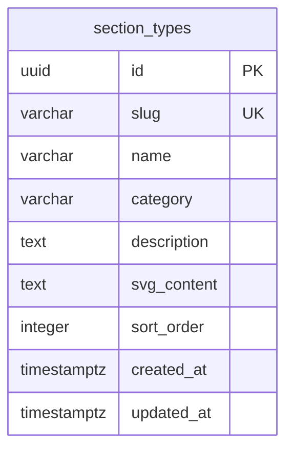

# Section Placeholder Library for Page Detection

## Overview

Replace the broken screenshot overlay highlighting system with a curated library of 65 section wireframe placeholders stored in the database. Each detected section displays its wireframe SVG thumbnail alongside metadata. A new Settings tab lets users manage the section library (add, edit, delete types and their SVG placeholders). The section taxonomy becomes a database-backed, editable type system instead of free-form AI strings.

## Problem Statement

1. **Screenshot overlays don't work** — percentage-based coordinate overlays are imprecise and often highlight wrong areas. Multiple iterations (percentage → pixel → HTML-guided) haven't solved this.
2. **Free-form section types** — AI returns arbitrary labels ("Benefits Feature Grid" vs "Feature Cards") that don't normalize. 17% of detections fall into an "other" bucket.
3. **No visual reference for section types** — detected sections display as plain text with no visual preview of what they represent.

## Proposed Solution

### 1. Database Table for Section Types

A new `section_types` table stores the taxonomy. This makes it editable through the UI without code changes.

```sql
CREATE TABLE section_types (
  id UUID PRIMARY KEY DEFAULT gen_random_uuid(),
  slug VARCHAR(100) NOT NULL UNIQUE,        -- "hero-split"
  name VARCHAR(255) NOT NULL,                -- "Hero Split"
  category VARCHAR(100) NOT NULL,            -- "Hero"
  description TEXT,                          -- "Text left, image right layout"
  svg_content TEXT,                          -- Raw SVG markup (inline)
  sort_order INTEGER NOT NULL DEFAULT 0,
  created_at TIMESTAMPTZ NOT NULL DEFAULT NOW(),
  updated_at TIMESTAMPTZ NOT NULL DEFAULT NOW()
);
```

**Why store SVG as text in the DB?**
- Editable via the Settings UI — no file deploys needed
- Each SVG is small (~1-3KB of markup)
- Can be rendered inline with `dangerouslySetInnerHTML` (safe since we control the content)
- Easy to seed from the v0 tool's exported SVGs

**65 section types across 14 categories:**

| Category | Types |
|----------|-------|
| Navigation | `navigation`, `sticky-header`, `mega-menu`, `breadcrumbs` |
| Hero | `hero`, `hero-split`, `hero-video`, `hero-slider` |
| Content | `about`, `content-block`, `card-grid`, `features`, `benefits`, `how-it-works`, `services`, `columns`, `text-block`, `stats`, `timeline`, `comparison` |
| Media | `image-gallery`, `video-section`, `bento-grid`, `masonry`, `carousel` |
| Social Proof | `testimonials`, `reviews`, `logo-cloud`, `case-studies`, `clients`, `awards` |
| CTA | `cta`, `cta-banner`, `banner`, `newsletter`, `download` |
| Forms | `contact-form`, `login-form`, `signup-form`, `search` |
| Commerce | `pricing`, `product-grid`, `product-featured`, `cart` |
| Blog | `blog-grid`, `blog-featured`, `blog-list`, `categories` |
| Support | `faq`, `accordion`, `tabs` |
| People | `team`, `author` |
| Footer | `footer`, `footer-simple`, `sitemap`, `social-links` |
| Location | `map`, `locations` |
| Utility | `divider`, `spacer`, `marquee`, `countdown`, `announcement` |

### 2. Extract SVGs from v0 Tool + Seed Database

**Source:** The user built a Section Placeholder Generator in v0.app (`/Users/chris/Downloads/placeholders/Section Placeholder Generator.html`). It contains React components rendering inline SVG wireframes for all 65 section types.

**Extraction approach:**
1. Open the saved HTML page in a browser using `agent-browser`
2. For each section type, get the rendered SVG element's `outerHTML` (use the "style-free" variant — style 3)
3. Create a seed script that inserts all 65 types with their SVG content into the `section_types` table

### 3. Settings Tab — Section Library Manager

A new **Settings** tab in the project layout at `/projects/[id]/settings` that shows:
- Grid/list of all section types grouped by category
- Each entry shows: SVG thumbnail, name, category, description
- Edit: click to update name, description, category, or replace SVG content
- Add: create new section types
- Delete: remove section types

This is a simple CRUD interface. Since the section library is global (not per-project), the Settings tab could also live at the app level (`/settings`). But putting it under projects keeps it accessible where users work.

### 4. Update Page Detail View

**Remove:**
- Screenshot overlay system (colored bands, percentage positioning, hover sync)
- `SECTION_COLORS`, `SECTION_BORDER_COLORS` arrays
- `hoveredSection`, `showOverlay`, `screenshotRef` state
- All overlay-related JSX and event handlers

**Keep:**
- Screenshot display (plain, no overlays)
- "Detect Components" / "Re-detect" button
- Section metadata (sectionLabel, component count)
- Component cards with type, complexity, styleDescription

**Add:**
- SVG thumbnail (120×80px) next to each section card, loaded from `section_types` table
- Section type name from taxonomy (falling back to raw `sectionLabel` for unknown types)

### 5. Simple Section Matching (Bridge Until Prompt Update)

Simple normalized lookup — no fuzzy matching:

```typescript
export function matchSectionType(
  label: string,
  sectionTypes: { slug: string; name: string; category: string }[]
): typeof sectionTypes[0] | null {
  const normalized = label.toLowerCase().replace(/[\s_]+/g, "-");
  // Direct match on slug
  const exact = sectionTypes.find(s => s.slug === normalized);
  if (exact) return exact;
  // Check if any slug is contained in the normalized label
  return sectionTypes.find(s => normalized.includes(s.slug)) ?? null;
}
```

This is intentionally simple — it will be replaced when the AI prompt is updated to return taxonomy slugs directly.

### 6. Update Detection Prompt (Later Phase — Out of Scope)

> **Note:** The AI prompt update to use this taxonomy is **out of scope** for this plan. The `yStartPercent`/`yEndPercent` coordinate fields and prompt instructions also stay as-is — they'll be cleaned up when the prompt is updated.

## Technical Approach

### Key Files

| File | Change |
|------|--------|
| `src/db/schema.ts` | **Modify** — Add `sectionTypes` table definition |
| `src/db/seed-section-types.ts` | **New** — Seed script to insert 65 types with SVGs extracted from v0 tool |
| `src/actions/section-types.ts` | **New** — Server actions: `getSectionTypes`, `updateSectionType`, `createSectionType`, `deleteSectionType` |
| `src/app/(dashboard)/projects/[id]/settings/page.tsx` | **New** — Settings tab route |
| `src/components/settings/section-library.tsx` | **New** — Section type CRUD manager component |
| `src/components/section-placeholder.tsx` | **New** — SVG thumbnail component (renders SVG from DB content) |
| `src/components/pages/page-detail.tsx` | **Modify** — Remove overlays, add SVG thumbnails to section list |
| `src/components/projects/project-tabs.tsx` | **Modify** — Add "Settings" tab |

### Database ERD



Note: `section_types` is a global table — not scoped to a project. All projects share the same section library.

### Implementation Phases

#### Phase 1: Database + Seed + Settings UI

- [x] Add `sectionTypes` table to `src/db/schema.ts`
- [x] Create and run Drizzle migration
- [x] Extract SVGs from v0 tool:
  - Open `/Users/chris/Downloads/placeholders/Section Placeholder Generator.html` in browser
  - For each section type, export the rendered SVG element's `outerHTML` (style-free variant)
- [x] Create seed script `src/db/seed-section-types.ts` — inserts all 65 types with SVG content
- [x] Run seed script to populate the table
- [x] Create server actions in `src/actions/section-types.ts`:
  - `getSectionTypes()` — fetch all, grouped by category
  - `updateSectionType(id, data)` — update name, description, category, svg_content
  - `createSectionType(data)` — add new type
  - `deleteSectionType(id)` — remove type
- [x] Add "Settings" to sidebar (app-level `/settings`)
- [x] Create Settings page at `src/app/(dashboard)/settings/page.tsx`
- [x] Create `src/components/settings/section-library.tsx` — grid of section types grouped by category, with edit/add/delete

#### Phase 2: Update Page Detail View

- [x] Remove screenshot overlay system from `page-detail.tsx`:
  - Remove `SECTION_COLORS`, `SECTION_BORDER_COLORS` constants
  - Remove `hoveredSection`, `showOverlay`, `screenshotRef` state
  - Remove overlay `<div>` elements on screenshot
  - Remove overlay toggle checkbox
  - Remove hover event handlers linking sections to overlays
- [x] Fetch section types from DB (server component passes as prop)
- [x] Add SVG placeholder thumbnails to section cards:
  - Match `sectionLabel` → section type using `matchSectionType`
  - Show SVG preview next to section heading
  - Fall back to a generic "No match" placeholder for unrecognized types
- [x] Keep screenshot as plain image (no overlays)
- [x] Keep detect button, error handling, loading states
- [x] Keep component cards within each section
- [x] Verify: no TypeScript errors (`pnpm tsc --noEmit`)

## Acceptance Criteria

- [ ] `section_types` database table created with 65 seeded entries including SVG content
- [ ] Settings tab shows all section types grouped by category with SVG previews
- [ ] Can edit section type name, description, category, and SVG content via Settings
- [ ] Can add new section types and delete existing ones
- [ ] Page detail view shows SVG thumbnails next to detected sections
- [ ] Screenshot overlay system is fully removed
- [ ] Screenshot still displays as plain image
- [ ] Detect/Re-detect button still works
- [ ] Unrecognized section types show a generic placeholder
- [ ] No TypeScript compilation errors

## Design Decisions

| Decision | Choice | Rationale |
|----------|--------|-----------|
| SVG source | Extract from user's v0 tool | Already built, consistent style, 65 types covered — don't reinvent |
| Storage | Database table with `svg_content` text column | Editable via UI, no file deploys, small payloads (~1-3KB each) |
| Scope | Global table (not per-project) | Section types are universal — all projects share the same library |
| Settings location | New "Settings" tab under projects | Accessible where users work, follows existing tab pattern |
| Old overlay removal | Full removal | Overlays were inaccurate across 3 iterations. Clean removal is better |
| Prompt update timing | Deferred to next plan | Focus UI + taxonomy first, then update AI prompt |
| Matching strategy | Simple normalized string lookup | Temporary bridge — replaced when AI prompt returns taxonomy slugs directly |
| `sectionType` on PageSection | Deferred | Add this field when the AI prompt is updated. No value now |

## Out of Scope

- AI prompt update to return taxonomy slugs (next plan)
- Removing `yStartPercent`/`yEndPercent` from prompt and type (clean up with prompt update)
- Drag-and-drop section reordering
- Section type editing from within the page detail view
- Exporting section wireframes
- Screenshot coordinate-based overlays (removed permanently)
- Adding `sectionType` field to `PageSection` interface (deferred to prompt update plan)
- SVG editor/drawing tool in the Settings UI (just a text field for SVG markup)

## References

- **SVG source:** `/Users/chris/Downloads/placeholders/Section Placeholder Generator.html` — v0.app project with 65 section definitions and SVG rendering components. Source file: `[project]/components/section-placeholders.tsx`. Section data: `[project]/lib/sections.ts`.
- `src/db/schema.ts` — existing schema (add `sectionTypes` table)
- `src/components/pages/page-detail.tsx` — current page detail with overlay system to remove
- `src/components/projects/project-tabs.tsx` — tab navigation (add "Settings" tab)
- `src/types/page-sections.ts` — `PageSection` type definition
- `src/services/components.ts:109-146` — `buildSectionPrompt` with current type vocabulary
- Previous plan: `docs/plans/2026-03-07-feat-per-page-component-detection-workbench-plan.md`
